# Anomaly Detection

[toc]

### 1. Definition （什么是异常检测?）

所谓outlier，就是异常点，问题的[形式化描述](http://speech.ee.ntu.edu.tw/~tlkagk/courses_ML19.html)为：

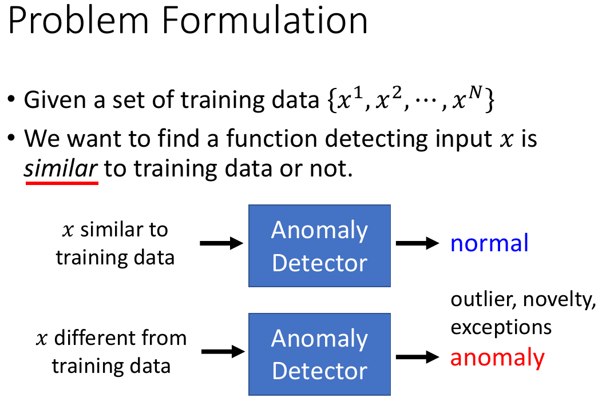

从数据的形式上划分，它可以被分为序列的和非序列的。

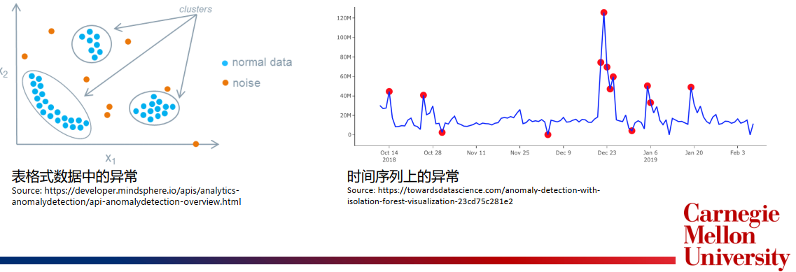

找outlier的==目的==一般有两个：

1. 过滤掉不需要的数据（异常值）；
2. 筛选出一些==有趣的==需要重点关注的事件，为了后续进一步的分析。

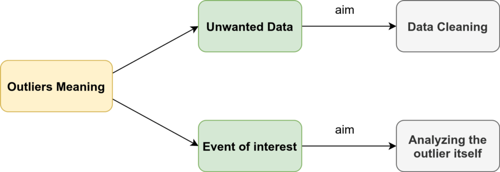

### 2. Application （有什么应用？）

异常检测的应用:
1. 金融行业的反欺诈、信用卡诈骗检测：把欺诈或者金融风险当做异常
2. 罕见病检测：把罕见病当做异常，比如检测早发的阿兹海默症
3. 入侵检测：把网络流量中的入侵当做异常
4. 机器故障检测: 实时监测发现或预测机械故障
5. 图结构、群体检测: 比如检测疫情的爆发点等

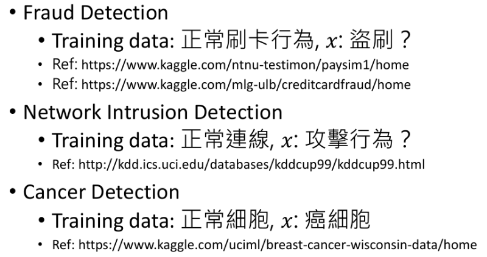

### 3. Challenges （挑战与难点）

1. 大部分情况下是==无监督学习==，没有标签信息可以使用 （在深度学习里，无监督学习普遍被认为较有监督学习难度更大，难度体现在学习的形式上及评价指标的设计上）
2. 数据是极端不平衡的（异常点仅占总体数据的一小部分），建模难度大
3. 检测方法往往涉及到度估计，需要进行==大量的距离/相似度计算==，运算开销大
4. 在实际场景中往往需要实时检测，这比离线检测的技术难度更高
5. 在实际场景中，我们常常需要同时处理很多案例，运算开销大
6. 解释性比较差，我们很难给出异常检测的原因，尤其是在高维数据上。但业务方需要了解异常成因
7. 在实际场景中，我们往往有一些检测的历史规则，如何与学习模型进行整合  

### 4. Common approaches （主流模型介绍）

异常检测==算法==可以大致被分为：

* 线性模型（Linear Model）： PCA
* 基于相似度度量的算法 （Proximity-based Model）： kNN, LOF, HBOS
* 基于概率的算法（Probabilistic Model）： COPOD
* 集成检测算法（Ensemble Model）：孤立森林（Isolation Forest）， XGBOD
* 神经网络算法（Neural Networks）：自编码器（AutoEncoder）

==评估方法==也不能简单用准确度（accuracy），因为数据的极端不平衡

* ROC (receiver-operating-characteristic) -AUC (area-under-curve)曲线
* F score：F1
* Precision @ Rank k： top k的准确率
* Average Precision：平均精准度

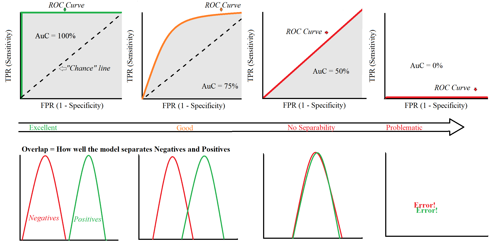

$F_{\beta}$ score也是用来平衡准确率和召回率的度量函数：（如果β为1，则Fβ退化为F1）
$$
F_{\beta}=\left(1+\beta^{2}\right) \cdot \frac{\text { precision } \cdot \text { recall }}{\left(\beta^{2} \cdot \text { precision }\right)+\text { recall }}
$$
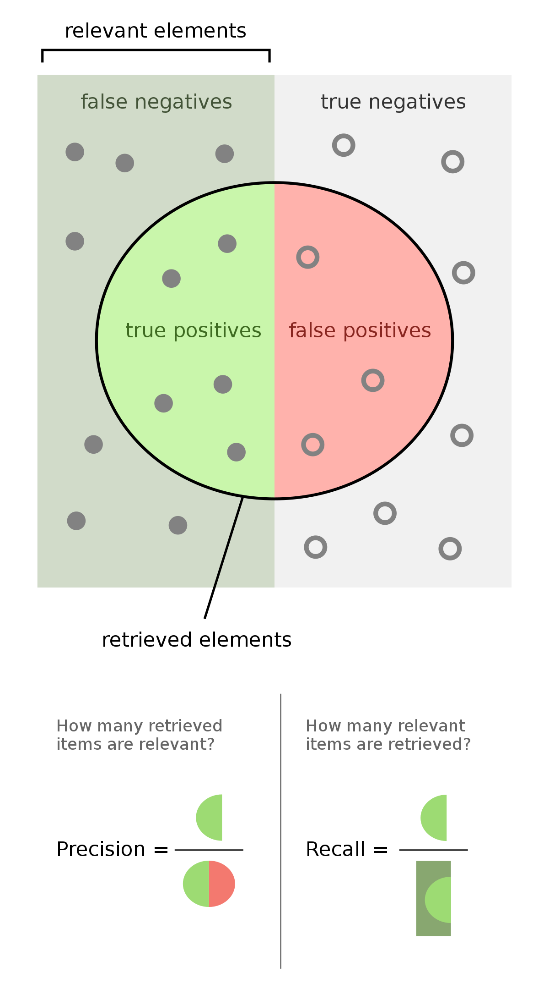

##### A. Supervised model - classification

如果我们有已经打了标签的数据集（不需要异常标签），那就可以把异常检测建模成一个分类问题，标签为所有正常类，然后根据分类的置信度来区分是否异常。

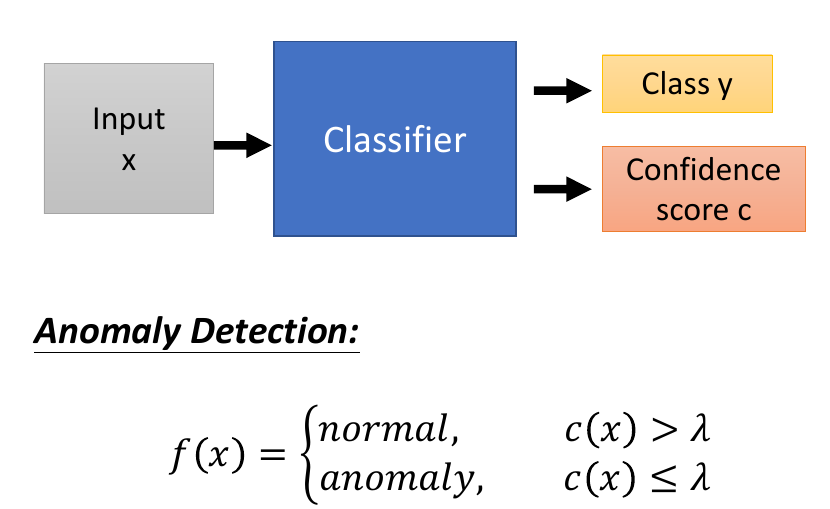

$\lambda$ can be determined by dev set performance on F1 score.

例如，我们要分类的问题：正常的是辛普森家族的每个角色，不正常的就是其他一些动漫角色。构造训练集，我们搜集一堆辛普森的样本（x-角色图片，y-角色名），然后训练模型进行分类。测试（dev set）的时候如果输入的是一个没见过的其他动漫角色，模型对它的分类就会==不自信==。

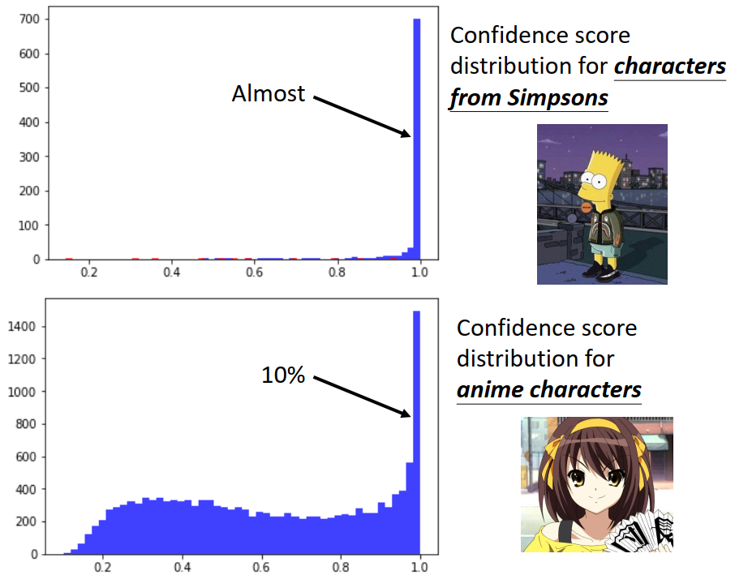

issue:

* 监督学习最大的问题就是它需要标签，打标签本事是一个需要大量成本的事。

##### B. Unsupervised model

advantage: need no labels.

###### B.1 Machine-learning

 ==Local Outlier Factor (LOF)== 就是KNN（聚类方法），可以想象如果要计算每个点与其他k个近邻点的距离，这个开销还是很大。

The anomaly score of each sample is called the Local Outlier Factor. It measures the local deviation of the density of a given sample with respect to its neighbors. It is local in that the anomaly score depends on how isolated the object is with respect to the surrounding neighborhood. More precisely, locality is given by k-nearest neighbors, whose distance is used to estimate the local density. By comparing the local density of a sample to the local densities of its neighbors, one can identify samples that have a substantially lower density than their neighbors. These are considered outliers.

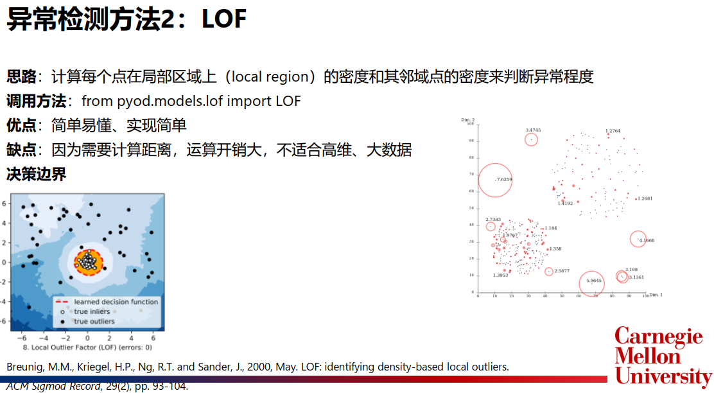

> knn:
>
> Example of *k*-NN classification. The test sample (green dot) should be classified either to blue squares or to red triangles. If *k = 3* (solid line circle) it is assigned to the red triangles because there are 2 triangles and only 1 square inside the inner circle. If *k = 5* (dashed line circle) it is assigned to the blue squares (3 squares vs. 2 triangles inside the outer circle).
>
> 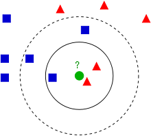

计算距离需要用到所有维度的信息，但是HBOS里可以并行的去计算每个维度的histogram，然后把histogram里密度较低的bin设置为异常范围。如果一个样本在很多维度上都落到了异常范围里，那它大概率就是异常的。

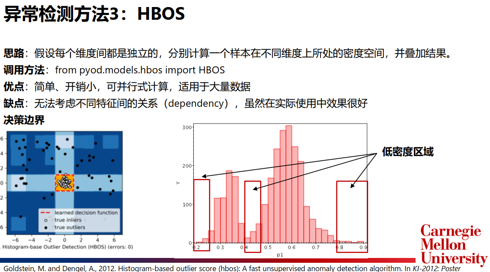

当然，上面两种方法都没有考虑维度相互间的互相关性信息，所以COPOD里对这个缺点做了处理：

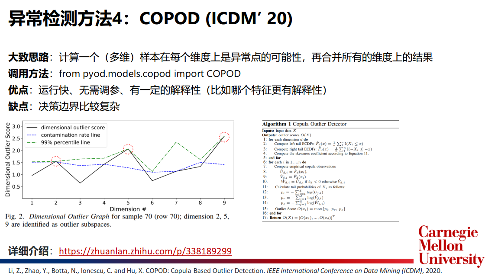

> A copula allows us to describe the joint distribution of (X1, · · · , Xd) using only their marginals. This gives a lot of flexibility when modelling high dimensional datasets, as we can model each dimension separately, and there is a guaranteed way to link the marginal distributions together to form the joint distribution.

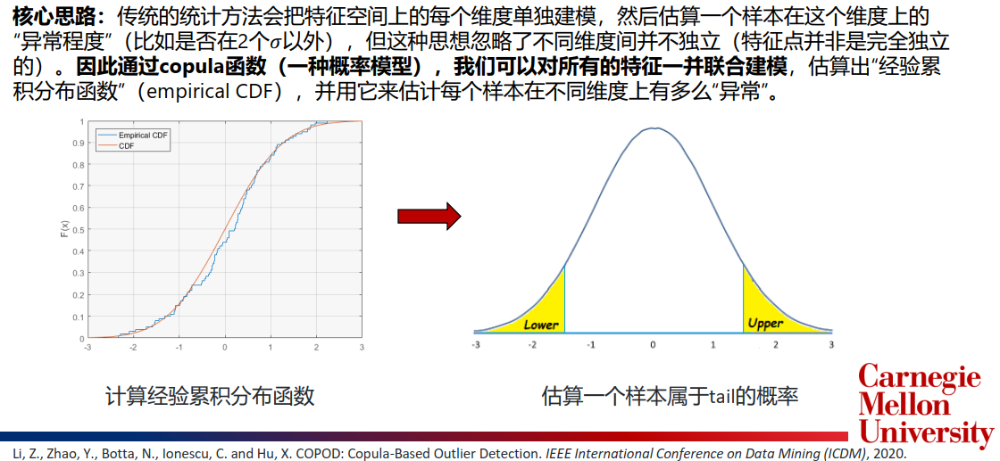

看[论文](https://www.andrew.cmu.edu/user/yuezhao2/papers/21-preprint-copod-journal.pdf)会发现这个经验的函数非常好计算，然后每个检测样本的tail probability也很好计算，整体计算成本比较低。Copula假设每一个维度的样本都是unimodal的，这是一个该方法的基本假设。

集成方法里，==isolation forest== 还是比较经典：

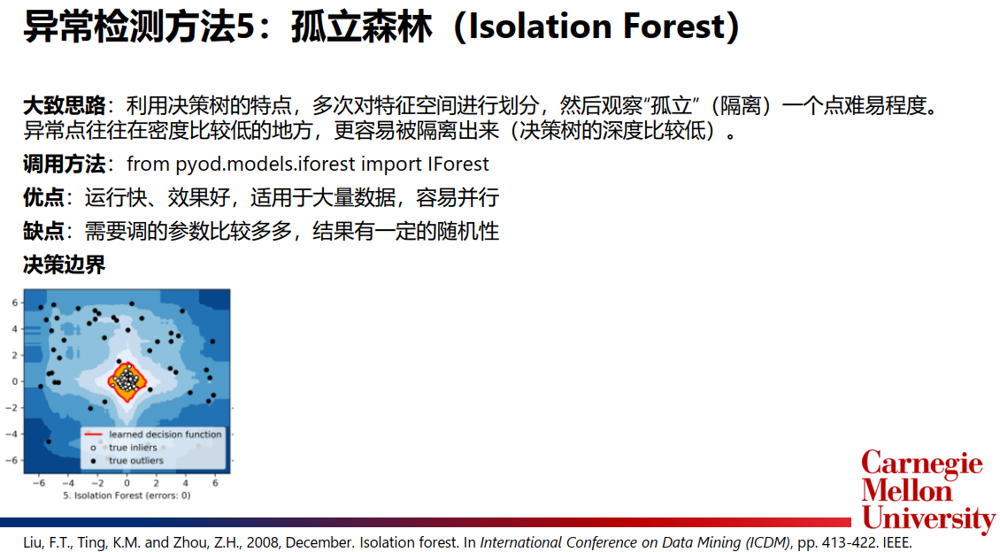

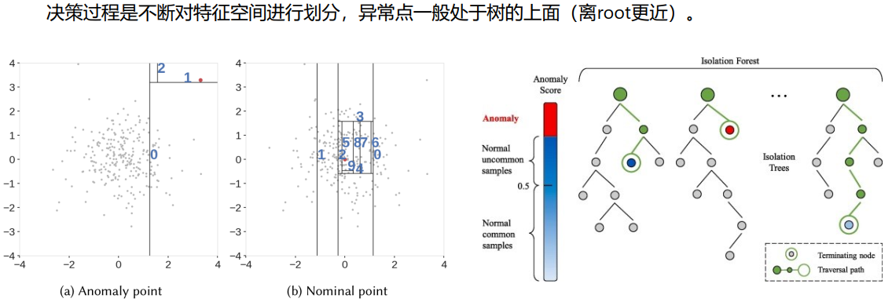

用概率模型直接估计分布密度:

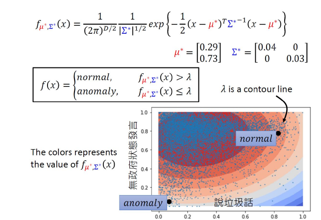

can be generalised to GMMs. distance metrics：Euclidean, Mahalanobis, etc.。

classification method: ==one-class svm==, (unsupervised)

One Class SVM 是指你的training data 只有一类positive（或者negative）的data，而没有另外 的一类。在这时，你需要learn的实际上你training data 的boundary。而这时不能使用 maximum margin 了，因为你没有两类的data。所以呢，在这边文章中，"Estimating the support of a high-dimensional distribution"， Schölkopf 假设最好的boundary要远离feature space 中的 原点。

左边是在original space中的boundary，可以看到有很多的boundary 都符合要求，但是比较靠谱 的是找一个比较紧 (closeness) 的boundary (红色的)。这个目标转换到feature space 就是找一个离原点比较远的boundary，同样是红色的直线。当然这些约束条件都是人为加上去的，你可以按照你自己的需要手取相应的约束条件。比如让你data 的中心离原点最远。

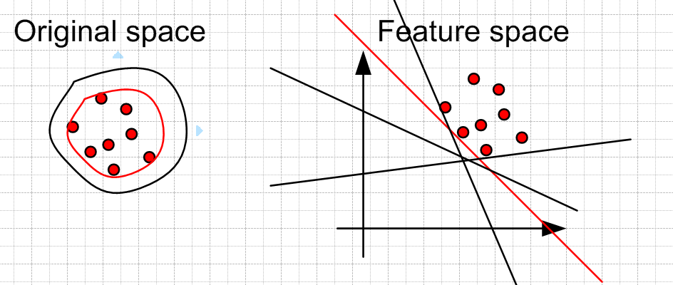

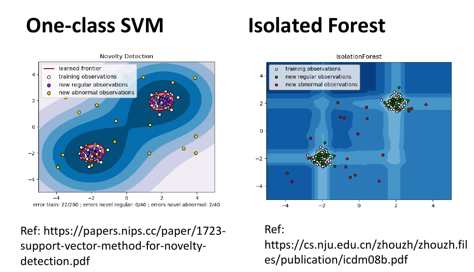

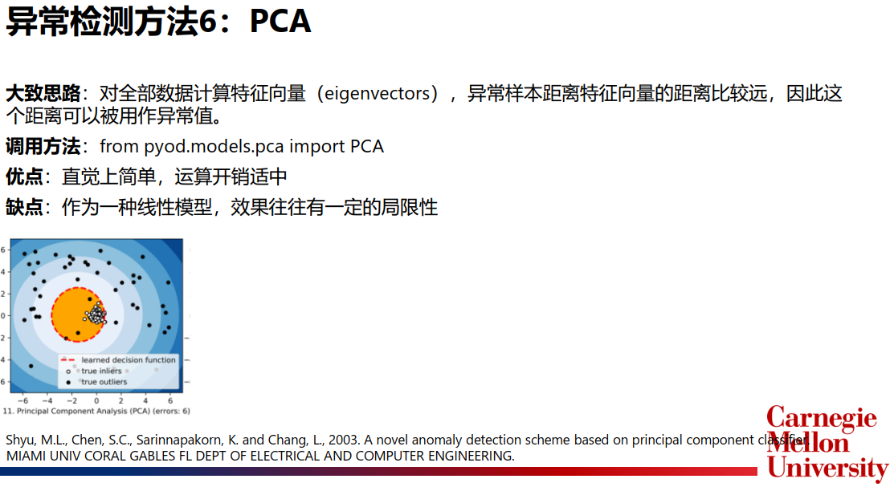

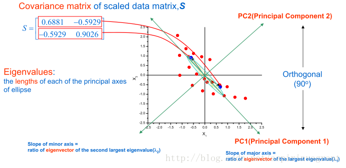

用PCA进行异常检测的原理是：PCA在做特征值分解之后得到的[特征向量](https://www.zhihu.com/search?q=特征向量&search_source=Entity&hybrid_search_source=Entity&hybrid_search_extra={"sourceType"%3A"article"%2C"sourceId"%3A48110105})反应了原始数据方差变化程度的不同方向，特征值为数据在对应方向上的方差大小。所以，最大特征值对应的特征向量为数据方差最大的方向，最小特征值对应的特征向量为数据方差最小的方向。原始数据在不同方向上的方差变化反应了其内在特点。如果单个数据样本跟整体数据样本表现出的特点不太一致，比如在某些方向上跟其它数据样本偏离较大，可能就表示该数据样本是一个异常点。

[A Novel Anomaly Detection Scheme Based on Principal Component Classifier:](https://homepages.laas.fr/owe/METROSEC/DOC/FDM03.pdf)
$$
\sum_{i=1}^{p} \frac{y_{i}^{2}}{\lambda_{i}}=\frac{y_{1}^{2}}{\lambda_{1}}+\frac{y_{2}^{2}}{\lambda_{2}}+\ldots+\frac{y_{p}^{2}}{\lambda_{p}}
$$
上面的{y1,y2,...,yp}是一个sample做了PCA之后的向量，然后 λ 对应特征向量的特征值，这个分数越大越说明它是异常值的可能性越大。

###### B.2 Deep-learning

深度学习模型的一个思路就是用模型去重构样本，如果是正常样本的话在整个集里出现的次数比较多那重构的结果就会很好，如果是异常样本那重构的结果就不好，我们可以根据重构结果和原样本的距离来评估是否是正常样本。

缺点是神经网络本身的运算开销也很大。

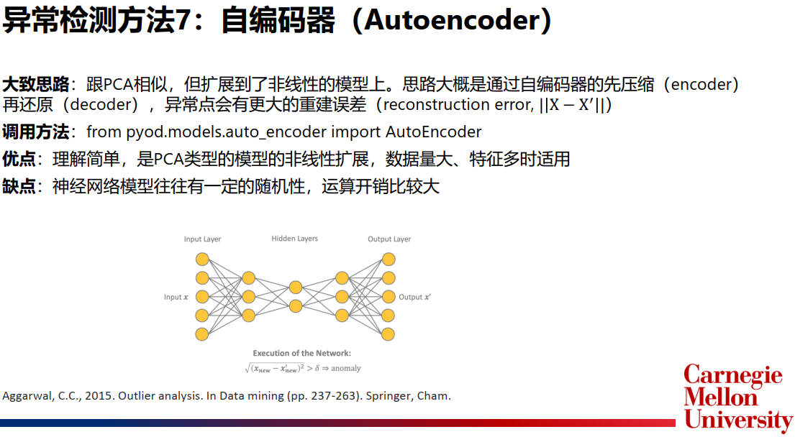

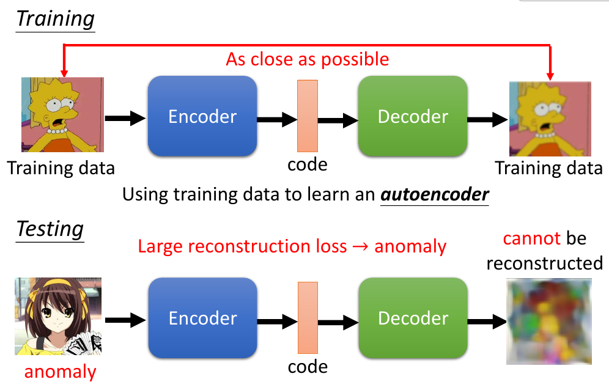

##### C. 模型选择

###### LSCP - 模型集成方式

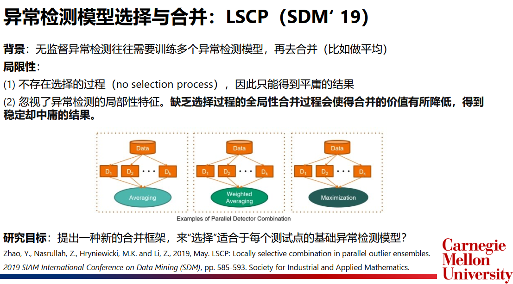

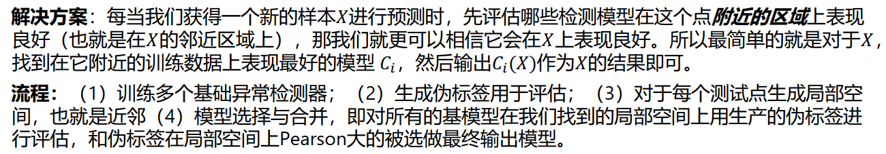

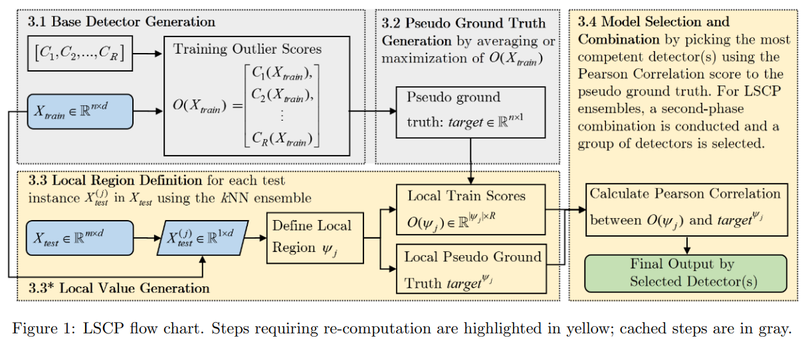

###### metaOD - 可行模型推荐

metaOD是模型集成的一种方式，就是有M个模型各自对n个数据集有输出拼接在一起组成表现矩阵P，我们再分解成UV矩阵，然后学习映射函数对U矩阵回归。最后在新data set上找出最适合的前n个模型进行后续的学习。

可想而知，要生成表现矩阵P就需要对n个数据集都有标签，所以文章作者提供了预训练模型，能直接针对新的数据集输出各个模型的表现结果。根据这个结果，我们可以选择top k个模型进行下一步的学习。

> **Given an unsupervised outlier detection (OD) task on a new dataset, how can we automatically select a good outlier detection method and its hyperparameter(s) (collectively called a model)?** Thus far, model selection for OD has been a "black art"; as any model evaluation is infeasible due to the lack of (i) hold-out data with labels, and (ii) a universal objective function. In this work, we develop the first principled data-driven approach to model selection for OD, called MetaOD, based on meta-learning. In short, MetaOD is trained on extensive OD benchmark datasets to capitalize the prior experience so that **it could select the potentially best performing model for unseen datasets**.
>
> Using MetaOD is easy. **You could pass in a dataset, and MetaOD will return the most performing outlier detection models for it**, which boosts both detection quality and reduces the cost of running multiple models.

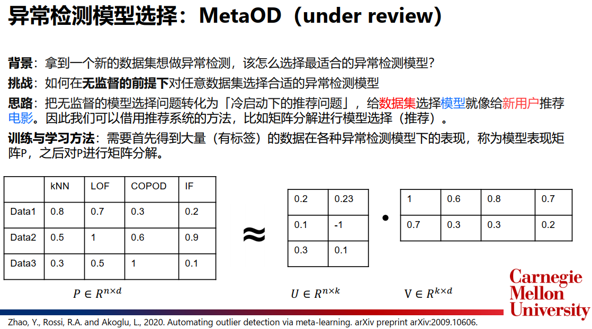

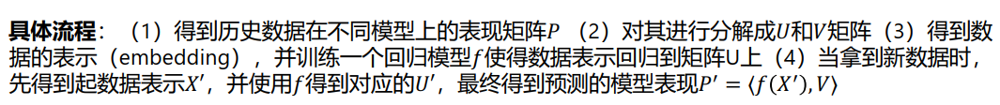

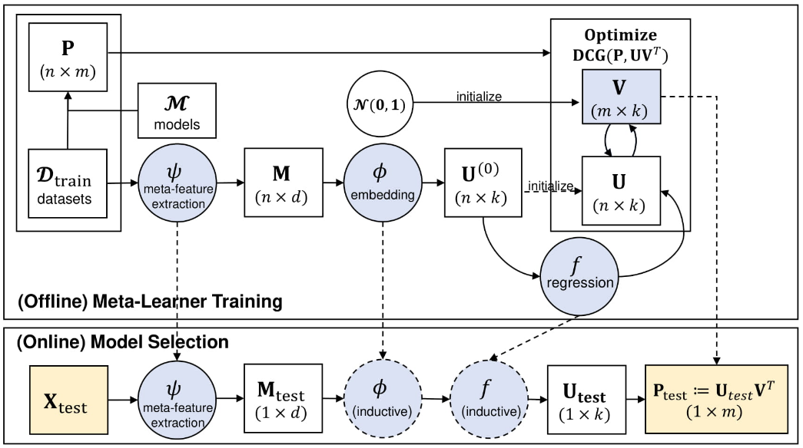

--------------

### 5. Time-series AD related issues

时序类的异常点检测的问题类型可分为：

* 点异常
* 子序列异常，也就是上下文异常
* 集合异常

时序异常最大的难点是怎么去==定义【异常】样本==，并依此去构造输入特征。

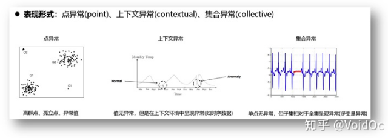

1. 点异常：可以直接定位离群点。
2. 上下文异常：上下文或集合异常可以先变换成点异常，然后再求解。模型可以选择ARIMA, 回归模型，LSTM等，核心思想就是模型学习一段历史数据然后==预测==，通过比对真实值与预测值的偏差来判断是否为异常。
4. 多序列异常（集合异常）：许多传感器应用程序产生的时间序列通常彼此紧密相关。例如，在一个传感器上的鸟叫通常也会被附近的传感器记录下来。在这种情况下，经常可以==使用一个序列来预测另一个序列==。与此类预期预测的偏差可以报告为异常值，如隐式马尔科夫链HMM等。

* 2020 paper shapelet GraphNetwork

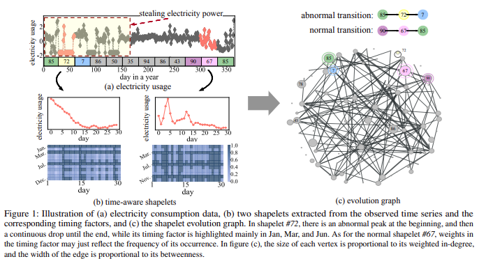

### 6. Open source libraries (工具概览)

[awesome-TS-anomaly-detection](https://github.com/rob-med/awesome-TS-anomaly-detection) 是所有热门的异常检测相关项目的一个汇总。

在它给的列表基础上，我做了一次筛选，筛选标准主要是以下4点。判断维度：

1. 星标数量。
2. 有没有时序相关的算法。
3. 所含算法是否先进，全面。
4. 项目是否还是actively maintained。

最后筛选出两个开源库：Kats 和 ADTK。

补充：

1. [PyOD](https://github.com/yzhao062/pyod)是异常检测里最热门的一个库 (5k stars（截止2021-11），来自CMU)，但是它的时序类算法支持不是很好，所以跳过。

   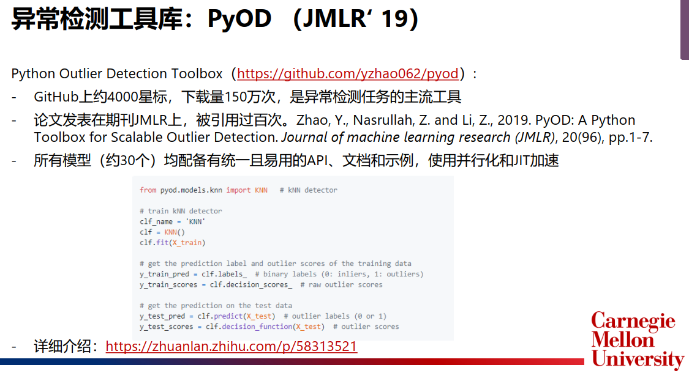

2. 英国国家数据科学实验室The Alan Turing Institute的 [sktime](https://github.com/sktime/sktime-tutorial-pydata-amsterdam-2020) 也是时序类高星项目，它是针对时序所有任务的大一统API（classification, regression, clustering, annotation and forecasting），但是它的分类里没有单对detection划分。

3. [tslearn](https://github.com/tslearn-team/tslearn) 也是大一统的API，不过没有sktime算法全和热门。

#### A. [Kats](https://facebookresearch.github.io/Kats/)

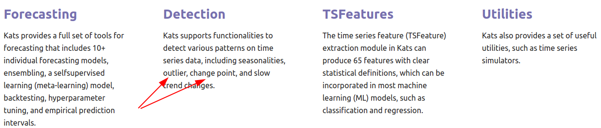

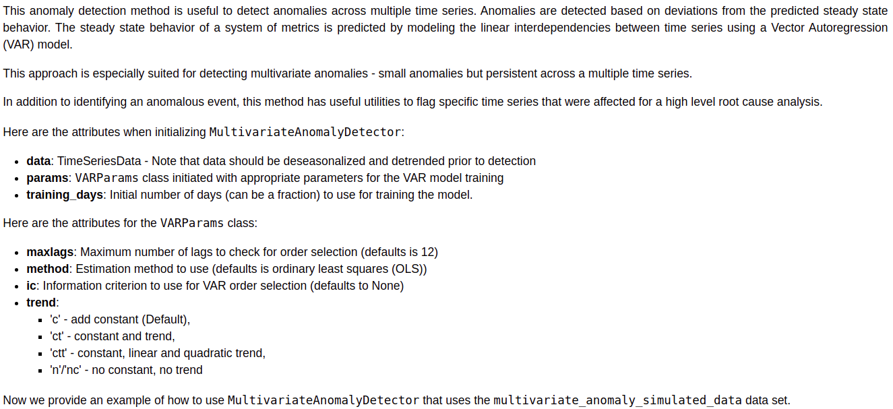

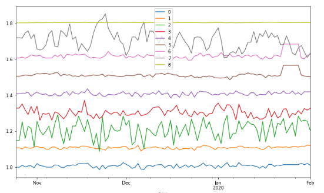

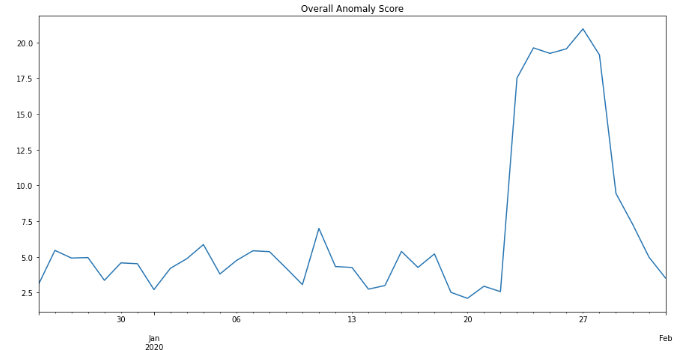

#### B. [ADTK](https://github.com/arundo/adtk)

ADTK 是 [Arundo](https://www.arundo.com/about-us) 公司开发的针对时序异常检测的框架。除了ADTK，它下面还有一个 [tsaug](https://github.com/arundo/tsaug) 库用来做时序数据的增强。Arundo公司本身就是做重资产工业数据分析（石油天然气，海事，能源，化工，工业设备）的，所以做的这个工具箱非常实用。它的主导开发者是 Tailai Wen，清华本科斯坦福的博士。

它的demo tutorial在这个 [链接](https://adtk.readthedocs.io/en/stable/notebooks/demo.html) 里，还有与其配套的 [speech](https://www.youtube.com/watch?v=im2kyhNPU8c)。整体来看，adtk提供了三个modules，通过这些module我们可以很直觉地搭建各种detector的pipeline。

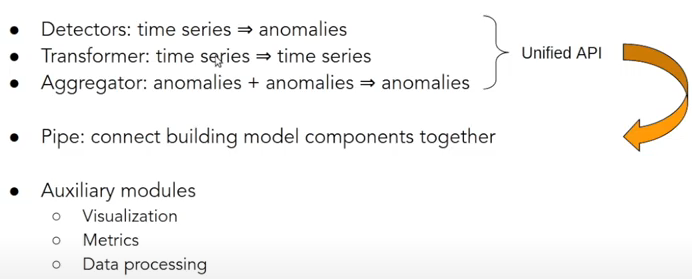

Detector里面有thresholdad，persistad，levelshiftad,volatilityshiftad, seasonalad等等基于基本统计的功能，这样搭建起来的检测器可解释性强且运行速度快。

### 7. Case study

案例在上述两个库里的tutorial都可以看到。

### 8. System design

首先如果在大量监控系统或指标里，人工设定阈值，人工排查原因的成本很高。所以我们需要一套自动化的异常检测系统，他应该具备的功能为：异常预警，指标设置&展示，故障收敛，日志记录的系统。

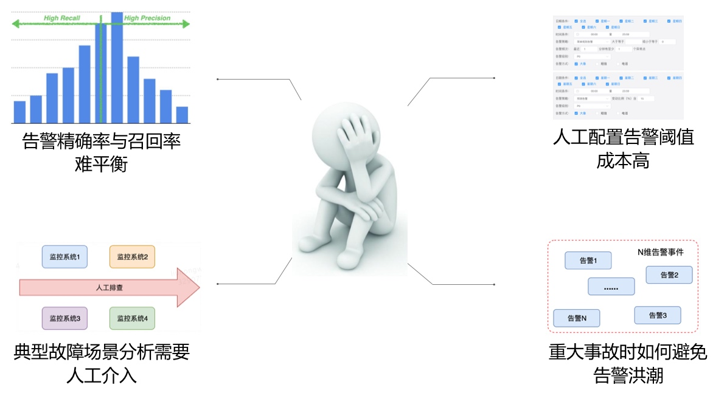

异常检测系统的一种架构：

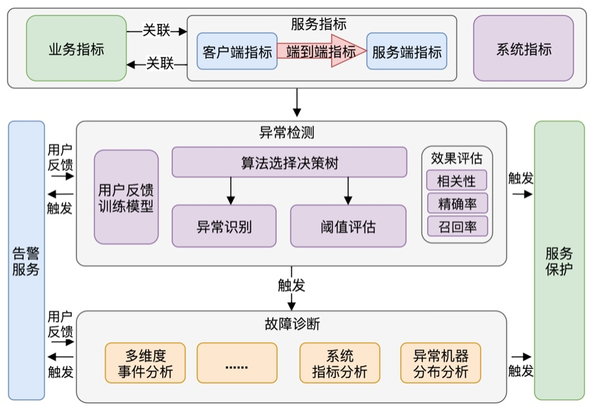

业务异常检测系统在整个稳定性保障体系中处在核心位置，承载着在业务出现重大事故时进行快速异常识别、定位根因、给出降级建议的责任。会分几大模块进行建设，具体如上图所示：

1. 多维度监控指标采集，这里主要包括：业务指标、应用指标（客户端、服务端、端到端）、系统指标（CPU、Memory、IO等）。指标采集需要尽可能短的链路，需要对指标进行==可信度==标记，尽可能给后续异常检测流程提供稳定准确的数据支持。
2. 通过对不同类型时间序列特征进行识别，选择对应的异常检测模型。这里不仅需要识别出异常，还需要进行不同告警等级的阈值计算，通过收集用户反馈信息对不同模型识别异常的效果进行评估，进行半监督学习不断修正模型效果。
3. 异常检测系统针对识别出的异常告警事件进行汇总分析，可以从更高维度对业务进行健康检查（比如：可以分析出某一业务链路在某些时间点不稳定），给出故障诊断报告。

下文里给出了一种[美团18年采用的基于形变分析的异常检测模型](http://siye1982.github.io/2018/12/16/shape_change/)，方法简单高效。

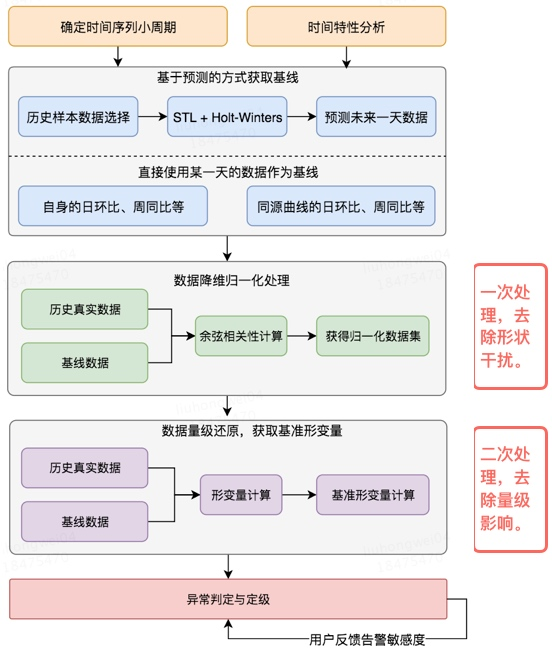

对于异常指标跟踪可以通过[状态机](https://segmentfault.com/a/1190000021412668)的形式：

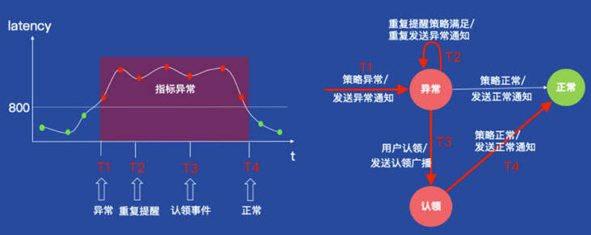

### 9. Last words

#### 实践技巧  

1. 假设数据是有标签的，优先使用监督学习，比如xgboost。如果数据量不是非常大，也可以尝试
   xgbod。如果是无监督的情况下，可以参考下面的流程。
2. 如果不知道如何选择合适的异常检测模型，可以使用MetaOD进行自动模型选择。如果不知道该选
   什么模型，优先选择孤立森林。
3. 如果是手动选择模型的话，首先要考虑数据量和数据结构。当数据量比较大（>10万条， >100个特
   征），优先选择可扩展性强的算法，比如孤立森林、 HBOS和COPOD。
4. 如果最终的结果需要一定的可解释性，可以选择孤立森林或者COPOD。
5. 如果数据量不大，且追求精度比较高的结果，可以尝试随机训练多个检测模型，并使用LSCP来进行
   合并。
6. 如果训练和预测过程比较缓慢、开销大的话，可以使用SUOD进行加速。
7. 如果数据量大、特征多，可以尝试用基于神经网络的方法，并有GPU并行等方法。  
8. 不要尝试一步到位用机器学习模型来代替传统模型。在理想情况下，应该尝试合并机器学习模型和基于规则的模型。可以尝试用已有的规则模型去解释异常检测模型。

#### 研究方向

1. 模型选择与跳槽
2. 大规模在线检测
3. 边缘计算
4. 深度学习模型

### 10. Resources（资源汇总）

https://github.com/yzhao062/anomaly-detection-resources
